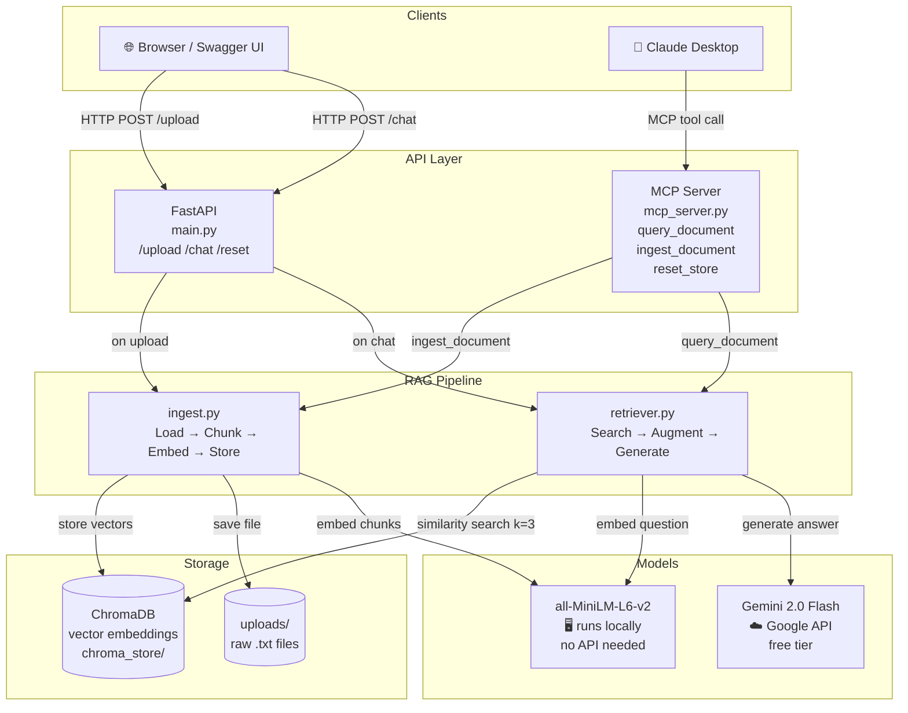
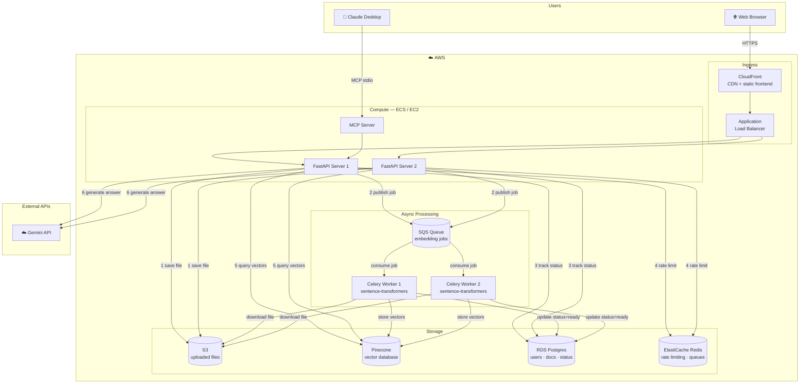

# DocuChat 🗂️

> Upload a document. Ask questions about it. Powered by RAG.

A backend service that lets you upload `.txt` files and ask natural language questions about them. Answers are grounded in your document — not hallucinated. Exposed as both a **REST API** and an **MCP server** for Claude Desktop.

---

## Tech Stack

| Layer | Tool |
|---|---|
| Backend | FastAPI |
| LLM | Google Gemini 2.0 Flash (free tier) |
| Embeddings | `sentence-transformers/all-MiniLM-L6-v2` — runs locally |
| Vector DB | ChromaDB — runs on disk |
| MCP Server | fastmcp |
| Language | Python 3.12 |

---

## How It Works — RAG Pipeline

**Ingestion** (runs once per document):
```
your file → load → chunk (500 chars, 50 overlap) → embed → store in ChromaDB
```

**Retrieval** (runs on every question):
```
question → embed → similarity search (k=3) → top chunks → Gemini → answer
```

The embedding model runs entirely on your machine — no API call needed for embeddings. Gemini only sees the 3 most relevant chunks, not the full document.

---

## App Architecture



---

## Production Architecture (AWS)



**Key production decisions:**
- **S3 + SQS** — upload returns instantly, embedding happens async in background
- **Pinecone** — shared vector DB all servers can read/write, replaces local ChromaDB
- **Celery workers** — CPU-heavy embedding isolated from API servers, scale independently
- **RDS Postgres** — tracks document status so frontend knows when a doc is ready to query
- **JWT auth** — stateless, any server can verify tokens without shared session storage

---

## Setup

```bash
# 1. Clone
git clone https://github.com/sumukhvarma21/docu-chat.git
cd docu-chat

# 2. Create virtual environment (Python 3.12 required)
python3.12 -m venv venv
source venv/bin/activate        # Windows: venv\Scripts\activate

# 3. Install dependencies
pip install -r requirements.txt

# 4. Add your Gemini API key
cp .env.example .env
# Edit .env → GOOGLE_API_KEY=your_key_here
# Get a free key at https://aistudio.google.com/app/apikey

# 5. Run
uvicorn main:app --reload
```

Open **http://localhost:8000/docs** — Swagger UI auto-generated from your code.

---

## API Endpoints

| Method | Endpoint | Description |
|---|---|---|
| `POST` | `/upload` | Upload a `.txt` file and ingest into ChromaDB |
| `POST` | `/chat` | Ask a question about the uploaded document |
| `DELETE` | `/reset` | Clear the vector store |
| `GET` | `/health` | Health check |

### Example

```bash
# Upload
curl -X POST http://localhost:8000/upload \
  -F "file=@document.txt"

# Ask a question
curl -X POST http://localhost:8000/chat \
  -H "Content-Type: application/json" \
  -d '{"question": "What is the main topic of this document?"}'
```

---

## MCP Server — Claude Desktop Integration

Expose DocuChat as tools Claude Desktop can call directly.

**1. Add to Claude Desktop config:**

Mac: `~/Library/Application Support/Claude/claude_desktop_config.json`
Windows: `%APPDATA%/Claude/claude_desktop_config.json`

```json
{
  "mcpServers": {
    "docuchat": {
      "command": "python",
      "args": ["/absolute/path/to/docu-chat/mcp_server.py"]
    }
  }
}
```

**2. Restart Claude Desktop.** Three tools become available:

| Tool | Description |
|---|---|
| `ingest_document` | Load a `.txt` file by absolute path |
| `query_document` | Ask a question about the ingested document |
| `reset_store` | Clear ChromaDB and start fresh |

---

## Project Structure

```
docu-chat/
├── main.py              # FastAPI app — REST endpoints
├── mcp_server.py        # MCP server — Claude Desktop tools
├── rag/
│   ├── ingest.py        # Load → chunk → embed → store
│   └── retriever.py     # Search → augment → generate
├── requirements.txt
├── .env.example
└── README.md
```

---

## Stretch Goals

- [ ] Multi-document support with `doc_id` namespacing in ChromaDB
- [ ] JWT authentication + per-user document isolation
- [ ] Conversation history for follow-up questions
- [ ] Simple HTML frontend
- [ ] Deploy to AWS (EC2 + S3 + SQS as per production architecture above)
